# 🚀 AI-Powered Invoice Parser & Translator - Product Requirements Document (PRD)

## 📋 Executive Summary

The AI-Powered Invoice Parser & Translator is a comprehensive solution that transforms traditional invoice processing workflows by combining advanced document parsing, multi-language translation, and intelligent data extraction capabilities. The system processes PDF invoices through a sophisticated pipeline that delivers structured, actionable data in multiple formats.

## 🎯 Product Vision

**"Transform any invoice, in any language, into structured business intelligence within seconds."**

Our solution bridges the gap between unstructured invoice documents and enterprise-ready data, enabling organizations to automate their accounts payable processes regardless of document complexity or language barriers.

## 🏗️ System Architecture & Component Flow

```mermaid
graph TD
    A[📄 PDF Invoice Upload] --> B[🔒 File Hash Generation]
    B --> C{💾 Cache Check}
    C -->|Cache Hit| D[⚡ Load Cached Data]
    C -->|Cache Miss| E[🔍 LlamaParse Processing]
    
    E --> F[📝 Markdown Conversion]
    F --> G[💾 Cache Markdown]
    F --> H[🌍 Language Detection]
    
    H --> I[🔤 Translation Service]
    I --> J[📖 Translated Content]
    J --> K[💾 Cache Translation]
    
    J --> L[🧠 LLM Structured Extraction]
    L --> M[📊 Structured Data]
    M --> N[💾 Cache Extraction]
    
    M --> O[📋 JSON View]
    M --> P[📊 Table View]
    M --> Q[📥 Download Options]
    
    D --> R[🖥️ Display Results]
    N --> R
    
    Q --> S[📄 JSON Export]
    Q --> T[📊 CSV Export]
    F --> U[📝 Markdown Export]
    K --> V[🌍 Translation Export]
```



## 🔧 Core Components

### 1. 📁 File Management & Caching System

**Purpose:** Efficient file handling and intelligent caching to optimize performance

**Components:**
- **File Hash Generator:** Creates unique MD5 hash for each uploaded file
- **Disk Cache Manager:** Persistent storage using pickle serialization
- **Session State Manager:** In-memory caching for immediate access
- **Cache Invalidation:** Smart cache clearing when new files are uploaded

**File Structure:**
```
cache/
├── {hash}_markdown.pkl     # Parsed markdown content
├── {hash}_translation.pkl  # Translation results
└── {hash}_extraction.pkl   # Structured extraction data
```

### 2. 🔍 Document Parsing Engine (LlamaParse)

**Purpose:** Convert PDF invoices into structured markdown format

**Capabilities:**
- Multi-modal document understanding
- Table extraction and preservation
- Image recognition and processing
- Auto-mode for intelligent content detection

**Configuration:**
```python
LlamaParse(
    result_type="markdown",
    auto_mode=True,
    auto_mode_trigger_on_image_in_page=True,
    auto_mode_trigger_on_table_in_page=True
)
```

### 3. 🌍 Translation Service

**Purpose:** Convert non-English invoices to English for standardized processing

**Features:**
- Automatic language detection
- Context-aware translation
- Preservation of formatting and structure
- Support for multiple languages

**Workflow:**
1. Detect source language from first page
2. Process each page individually
3. Maintain document structure
4. Combine translated content

### 4. 🧠 Intelligent Data Extraction

**Purpose:** Transform translated text into structured business data

**Data Models:**
- **MerchantDetails:** Vendor/seller information
- **BillToDetails:** Customer/buyer information  
- **InvoiceItem:** Line items with business line categorization
- **TaxLineSummary:** Tax breakdown by rates
- **InvoiceData:** Complete invoice structure

**Extraction Process:**
```python
ExtractConfig(
    use_reasoning=True,
    extraction_mode=ExtractMode.MULTIMODAL,
    system_prompt="Enhanced extraction with merchant/customer distinction"
)
```

### 5. 📊 Data Visualization & Export

**Purpose:** Present extracted data in multiple formats for different use cases

**Visualization Options:**
- **JSON View:** Raw structured data for developers
- **Table View:** Business-friendly tabular format
- **Downloadable Formats:** JSON, CSV, Markdown

**Export Capabilities:**
- Timestamped file naming
- Structured CSV with sections
- Formatted markdown with metadata
- Complete data preservation

## 📈 Data Flow Pipeline

### Phase 1: Input Processing
1. **File Upload:** User uploads PDF invoice
2. **Hash Generation:** Create unique identifier for caching
3. **Cache Check:** Verify if file was previously processed

### Phase 2: Document Parsing
1. **LlamaParse Processing:** Convert PDF to markdown
2. **Content Structuring:** Organize multi-page content
3. **Cache Storage:** Save results for future use

### Phase 3: Language Processing
1. **Language Detection:** Identify source language
2. **Translation:** Convert to English if needed
3. **Content Formatting:** Maintain structure and formatting

### Phase 4: Data Extraction
1. **LLM Analysis:** Apply structured extraction model
2. **Entity Recognition:** Identify merchants, customers, items
3. **Data Validation:** Ensure completeness and accuracy

### Phase 5: Output Generation
1. **Multi-Format Display:** JSON and table views
2. **Export Options:** Generate downloadable files
3. **Cache Management:** Update stored results

## 🎨 User Experience Flow

```
📄 Upload Invoice
    ↓
🔍 Automatic Processing
    ↓
📋 View Results (JSON/Table)
    ↓
📥 Download Data (JSON/CSV/Markdown)
```

### Key UX Features:
- **Progressive Loading:** Real-time status updates
- **Cache Indicators:** Visual feedback for cached vs. new processing
- **Multi-Tab Interface:** Organized content presentation
- **One-Click Downloads:** Instant export without re-processing

## 🏆 Technical Specifications

### Performance Characteristics
- **First Processing:** Full pipeline execution + caching
- **Subsequent Access:** Instant loading from cache
- **Download Operations:** No pipeline re-execution
- **Cache Persistence:** Survives application restarts

### Scalability Features
- **Horizontal Scaling:** Stateless processing components
- **Cache Optimization:** Intelligent storage management
- **Resource Efficiency:** Reduced API calls through caching

### Security Considerations
- **File Isolation:** Temporary file handling
- **Cache Encryption:** Secure storage of sensitive data
- **Access Control:** Session-based data management

## 📋 Data Models & Schema

### Core Entity Structure
```python
InvoiceData:
├── merchant: MerchantDetails
├── bill_to: BillToDetails (Optional)
├── invoice_details: InvoiceMetadata
├── financial_summary: AmountBreakdown
├── items: List[InvoiceItem]
└── tax_summaries: List[TaxLineSummary]
```

### Business Intelligence Output
- **Merchant Analysis:** Vendor information and banking details
- **Customer Tracking:** Bill-to information and relationships
- **Item Categorization:** Business line classification
- **Financial Breakdown:** Tax analysis and amount reconciliation

## 🚀 Deployment & Infrastructure

### Application Stack
- **Frontend:** Streamlit web interface
- **Backend:** Python with LlamaCloud integration
- **Storage:** Local file system with pickle serialization
- **Caching:** Multi-layer (session + disk) strategy

### External Dependencies
- **LlamaCloud API:** Document parsing and extraction
- **Translation Service:** Multi-language support
- **PDF Processing:** Document handling capabilities

## 🔮 Future Enhancements

### Planned Features
- **Batch Processing:** Multiple file uploads
- **API Integration:** RESTful service endpoints
- **Advanced Analytics:** Invoice trend analysis
- **Custom Templates:** Industry-specific extraction models

### Potential Integrations
- **ERP Systems:** Direct data push capabilities
- **Database Connectivity:** Structured data storage
- **Workflow Automation:** Integration with business processes
- **Advanced Reporting:** Business intelligence dashboards

---